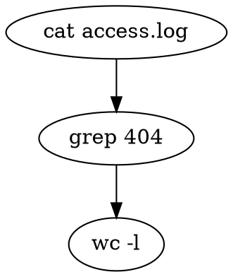

# gripeline

A graph *is* a pipeline.

`gripeline` runs ordinary [Graphviz](https://graphviz.org) `dot` files as shell
pipelines. The same file you hand to `dot -Tpng` to draw a picture, you hand to
`gripeline` to run a `bash` pipeline — the diagram conveys data flow the way a
`cmd1 | cmd2 | cmd3` one-liner does, only more clearly when it branches.



- **[SPEC.md](SPEC.md)** — execution semantics: how nodes/edges map to
  programs, files, streams, and file descriptors; three mappings (Commands,
  Dataflow, Typed); control flow, variables, loops; what makes a diagram
  renderable-but-not-executable; and a gallery of bash ⇄ dot examples.
- **[tests/](tests/)** — a conformance harness and fixtures that validate a
  transpiler (`python3 tests/run.py`). See [tests/README.md](tests/README.md).

Status: design draft with a working transpiler. [`gripeline.py`](gripeline.py)
(Python 3, standard library only) parses real `dot`, resolves roles, runs the
§9 static check, and emits `bash`. Run it via the [`gripeline`](gripeline) shim:

```bash
./gripeline build foo.dot     # print transpiled bash to stdout
./gripeline run   foo.dot     # transpile then exec under bash
./gripeline check foo.dot     # §9 static check only (exit 0, or 65 if not executable)
```

The conformance harness passes under either invocation form:

```bash
GRIPELINE=./gripeline            python3 tests/run.py
GRIPELINE='python3 gripeline.py' python3 tests/run.py
```
