# gripeline — a specification for executing Graphviz `dot` files as shell pipelines

**Status:** Draft 0.2 (design exploration)
**Source language:** unmodified Graphviz `dot`
**Execution model:** transpile to `bash`
**Scope:** pipes, files, file-descriptor routing, fan-out/fan-in, sequencing &
conditionals, subshells/functions, variables, command substitution, and loops.

> A `gripeline` program is an ordinary Graphviz `dot` file. The same file you can
> hand to `dot -Tpng` to draw a picture, you can hand to `gripeline` to run a
> shell pipeline. This document defines what that file *means* when it is run.

---

## Table of contents

1. [Goals and non-goals](#1-goals-and-non-goals)
2. [How dot text becomes a program](#2-how-dot-text-becomes-a-program)
3. [The execution graph vs. the rendering attributes](#3-the-execution-graph-vs-the-rendering-attributes)
4. [Three mappings (and how they relate)](#4-three-mappings)
   - [4.1 The Commands mapping](#41-the-commands-mapping--nodes-are-programs-edges-are-pipes)
   - [4.2 The Dataflow mapping](#42-the-dataflow-mapping--nodes-are-data-edges-are-programs)
   - [4.3 The Typed mapping](#43-the-typed-mapping--typed-nodes-the-general-model)
   - [4.4 Declaring the mapping](#44-declaring-the-mapping)
5. [File descriptors and ports](#5-file-descriptors-and-ports)
6. [Control flow: sequencing, conditionals, grouping](#6-control-flow)
7. [Variables and command substitution](#7-variables-and-command-substitution)
8. [Loops](#8-loops)
9. [Renderable but not executable: diagnostics](#9-renderable-but-not-executable)
10. [Reserved attribute reference](#10-reserved-attribute-reference)
11. [Conformance](#11-conformance)
12. [Example gallery (bash ⇄ all three mappings)](#12-example-gallery)
13. [Resolved decisions and open questions](#13-resolved-decisions-and-open-questions)

---

## 1. Goals and non-goals

**Goals**

- Let a person *author a shell pipeline by drawing a graph*, where the picture
  conveys data flow at least as clearly as `cmd1 | cmd2 | cmd3` conveys it
  textually — and usually more clearly for anything that branches.
- Keep the source 100% valid `dot`: it must render with stock Graphviz, and it
  must run with `gripeline`, with no preprocessing.
- Make the common case trivial: a straight chain of arrows is a straight pipe.
- Cover *as much of bash as can be expressed without hurting readability* — up to
  and including variables and loops — while letting a diagram opt to use only a
  tiny subset.
- When a diagram can be drawn but not run, say *why*, both as text and as
  annotations layered back onto the drawing.

**Non-goals**

- Reproducing every bash builtin, expansion rule, or quoting corner. gripeline
  targets the readable 90%; an escape hatch (`gl_raw`) covers the rest.
- Being a new general-purpose language. The semantics are defined *by
  translation to bash*. If you want to know exactly what a graph does, read the
  bash it transpiles to.
- Layout. gripeline never positions nodes; that is Graphviz's job.

---

## 2. How dot text becomes a program

```
 ┌────────────┐   parse    ┌───────────┐   extract    ┌────────────────┐
 │ foo.dot    │ ─────────▶ │ dot AST   │ ───────────▶ │ execution graph│
 │ (any dot)  │            │           │  (§3)        │ (nodes/edges/  │
 └────────────┘            └───────────┘              │  ports/roles)  │
        │                        │                     └───────┬────────┘
        │ dot -Tpng              │ gl_* + topology              │ check (§9)
        ▼                        ▼                              ▼
   a picture                a picture                   ┌────────────────┐
                                                        │ bash script    │
                                                        │  (the meaning) │
                                                        └────────────────┘
```

`gripeline run foo.dot` =

1. **Parse** the dot file (a real dot parser; comments `//`, `/* */`, `#` are
   allowed; `node`/`edge`/`graph` default statements are honored).
2. **Extract** the *execution graph* (§3) by reading only execution-relevant
   information and discarding pure styling.
3. **Check** executability (§9). If it fails, emit diagnostics and (optionally) a
   red-annotated copy of the graph, and stop.
4. **Transpile** to bash and either print it (`gripeline build`) or run it
   (`gripeline run`).

The transpiler emits bash that runs under a configurable prologue (default
`set -euo pipefail`). **The bash output is the normative definition of what a
graph means.** Every rule below is ultimately "…which transpiles to *this*
bash."

---

## 3. The execution graph vs. the rendering attributes

A dot file mixes two kinds of information. gripeline reads the first and ignores
the second.

**Execution-relevant (read):**

- The graph *kind*: `digraph` is required (a `graph` is not executable, §9).
- Node identities, the nesting of `subgraph`/`cluster` blocks.
- Edge endpoints and their **ports** (`a:1 -> b:0`).
- A node's **operation text**, taken from `label` if present, else the node id.
- An edge's **operation text** (used by the Dataflow mapping), taken from its
  `label`.
- The reserved `gl_*` attributes (§10) and the role-bearing `shape` values.

**Rendering-only (ignored by execution):**

- `pos`, `width`, `height`, `rankdir`, `ranksep`, `nodesep`, `splines`, …
- `color`, `fillcolor`, `bgcolor`, `fontname`, `fontsize`, `fontcolor`,
  `penwidth`, `style` (as decoration), `peripheries`, `image`, …
- `shape`, *except* for the small reserved set that denotes a role (§10).

> A diagram may be 90% rendering attributes — colors, clusters drawn for visual
> grouping, ranks, fixed positions — and gripeline will simply not look at them.
> This is intentional: the picture you tune for a slide deck is the same file
> that runs.

**Semantics live in `gl_*`, not in styling.** It is tempting to say "a dashed
edge means sequencing." gripeline does *not* infer meaning from `style`/`color`,
because that would make the same picture mean different things after a cosmetic
edit. Instead, meaning is carried by reserved attributes, and the spec
*recommends a matching visual convention* so the drawing looks like what it does:

| meaning            | reserved attribute     | recommended styling (optional) |
|--------------------|------------------------|--------------------------------|
| pipe (data)        | *(default)*            | solid black                    |
| sequence `;`       | `gl_edge=seq`          | `style=dashed`                 |
| and `&&`           | `gl_edge=and`          | `color=darkgreen,label="&&"`   |
| or `\|\|`          | `gl_edge=or`           | `color=orange,label="\|\|"`    |
| redirect to file   | *(file node endpoint)* | `style=bold`                   |

An implementation MAY offer a `--infer-style` mode that *also* reads the visual
convention, but conforming default behavior reads only `gl_*` + topology.

---

## 4. Three mappings

The same shell concepts — **programs**, **streams/files**, **the wiring between
them** — can be assigned to dot's **nodes** and **edges** in three ways, which
this spec names by what a *node* represents:

| mapping        | a **node** is…        | an **edge** is…   | best at                         |
|----------------|-----------------------|-------------------|---------------------------------|
| **Commands**   | a program             | a pipe            | straight pipelines (the 90%)    |
| **Dataflow**   | a value / stream      | a program (label) | reuse, fan-out, variables       |
| **Typed**      | a typed thing (role)  | role-dependent    | everything; the general model   |

They are not three different languages; they are three *conventions* over the
same file format, and they interoperate through one underlying model (the Typed
mapping).

Quick taste, all computing `cat access.log | grep 404 | wc -l`:

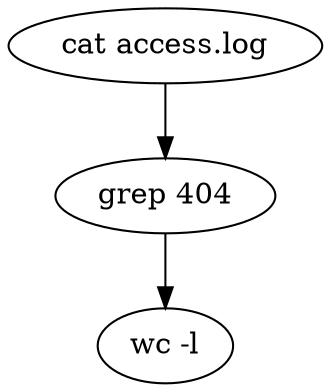
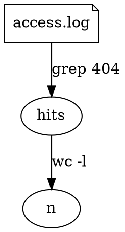
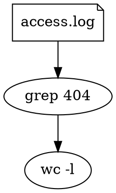

### 4.1 The Commands mapping — nodes are programs, edges are pipes

The literal pipeline. The thing you see in the boxes is the command; the arrow is
the `|`.

**Rules**

- **Node = a command invocation.** Its command line is `label` if present, else
  the node id. (Use ids as short handles; put the real command in `label`.)
- **Edge = a pipe.** `a -> b` means "connect `a`'s stdout to `b`'s stdin," i.e.
  `a | b`. (Generalized by ports, §5.)
- **A file** is a node with `shape=note` (or `gl_role=file`); its `label` is the
  path. A file node as an edge *tail* is a read (`<`); as a *head* it is a write
  (`>`, or `>>` with `gl_append=true`).
- **Fan-out** (a node with several data out-edges) → `tee` / process
  substitution (§12.4).
- **Fan-in** (several data edges into one stdin) → `cat <(…) <(…)` (§12.5).
- **Grouping** uses `subgraph cluster_*` → subshell `( … )`, or a function with
  `gl_role=function` (§6).

A straight chain of *n* nodes is an *n*-stage pipeline. This is the mapping that
most directly answers "make it look like a bash pipeline."

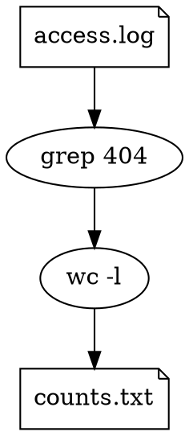

### 4.2 The Dataflow mapping — nodes are data, edges are programs

Nodes are *values* flowing through the system; an edge is the *transformation*
that turns the value at its tail into the value at its head, and the
transformation's command is the **edge `label`**.

**Rules**

- **Node = a named value/stream/file.** A node with no in-edges is an *input*; a
  node with no out-edges is an *output*. A node with `shape=note` (or whose
  id/label is a path) is a real file; otherwise it is an anonymous buffer
  realized as a pipe or temp file.
- **Edge = a program.** `x -> y [label="grep 404"]` means `y` is `x` filtered by
  `grep 404`. A linear chain `i -> a -> b -> o` with edge labels is the pipeline
  `<i  prog_a | prog_b  >o`.
- **Fan-out is natural**: a value node with several out-edges is a value consumed
  by several programs (transpiles via `tee`/process substitution or by
  materializing the node).
- **Multi-input programs are awkward**: a dot edge has exactly one tail, so a
  program that consumes two values needs a *junction node* (`gl_role=op`, label =
  the program) with several in-edges. This is the Dataflow mapping leaking toward
  Typed, and is the main reason it is not always the most concise (see §12.5).
- **Variables are beautiful** here: a node *is* a named value, so
  `today [label="$(date +%F)"]` defines a variable other edges can reference
  (§7).

Dataflow shines when intermediate data is *named and reused*; it is verbose for a
plain `a | b | c` (you must name the otherwise-anonymous streams) and clumsy for
control flow.

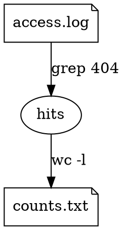

### 4.3 The Typed mapping — typed nodes (the general model)

The Commands and Dataflow mappings are special cases of one model: **every node
has a role, and an edge's meaning is determined by the roles of its endpoints.**
Typed is the model the transpiler actually works in; the other two are
restrictions that fix most roles by convention so you don't have to spell them
out.

**Node roles** (from `shape`, or explicitly `gl_role=…`):

| role      | how to write it                       | meaning                              |
|-----------|---------------------------------------|--------------------------------------|
| `program` | `shape=box`/default, or any box-ish   | a command (text from `label`/id)     |
| `file`    | `shape=note`                          | a file on disk (`label` = path)      |
| `stream`  | `shape=cds`                           | a named buffer / fifo                |
| `value`   | `shape=oval` + `gl_role=value`        | a variable (§7)                      |
| `op`      | `shape=box` + multiple typed inputs   | a multi-input program / merge point  |
| `control` | `gl_role=for`/`while`/`if`/`function` | a control construct (§6, §8)         |

**Edge meaning by endpoint roles:**

| tail → head             | meaning              | bash                         |
|-------------------------|----------------------|------------------------------|
| program → program       | pipe                 | `tail \| head`               |
| file → program          | read redirect        | `head < file`                |
| program → file          | write redirect       | `tail > file` (`>>` append)  |
| program → program ports | fd wiring            | see §5                       |
| value → program         | variable use         | `$value` substituted (§7)    |
| program → value         | capture              | `value=$(tail)` (§7)         |

Because roles are explicit, Typed handles everything Commands and Dataflow handle
*and* the cases each finds awkward (multi-input ops, files mixed with pipes, fd
routing, variables). The cost is that you sometimes annotate roles. The
recommendation: **author in Commands or Dataflow for clarity; reach into Typed
only where you need a role the others don't give you for free.** A single file
may freely mix conventions — the underlying model is the same.

### 4.4 Declaring the mapping

A file declares its convention with a graph attribute:

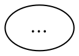

- `gl_mapping="commands"` — unlabeled edges are pipes; node text is the command.
- `gl_mapping="dataflow"` — node text is data; edge `label` is the command.
- `gl_mapping="typed"` (default) — roles drive everything; unspecified roles
  default to `program` for box-ish shapes and `file` for `note`.

The mapping only changes *defaults*; explicit `gl_role`/ports always win, so the
three are interoperable within one file.

---

## 5. File descriptors and ports

Graphviz nodes have named **ports** — the little connection points you can attach
edges to. gripeline maps **ports to file descriptors**, which makes stream
routing visually exact and absorbs the parts of bash redirection that are usually
hard to read.

**Port → fd mapping** (names are case-insensitive; either form works):

| port name          | fd  |
|--------------------|-----|
| `in`  / `stdin`  / `0` | 0 |
| `out` / `stdout` / `1` | 1 |
| `err` / `stderr` / `2` | 2 |
| `3`, `4`, …        | that fd |

**Defaults:** a tail with no port means `out` (1); a head with no port means
`in` (0). Therefore the bare `a -> b` is `a:out -> b:in` is `a | b`.

**fd duplication / merge:** an edge from one port to another port *on the same
node* is an fd dup. The classic `2>&1`:

```dot
build [label="make"]
build:err -> build:out        // make 2>&1   (stderr follows stdout)
```

**Routing examples (Commands/Typed):**

```dot
make [label="make"]
errlog [shape=note,label="build.err"]
make:err -> errlog            //  make 2> build.err

deploy[label="deploy"]
make:out -> deploy:in         //  make | deploy   (explicit; same as make->deploy)
```

> In the Dataflow mapping, where edges are programs, fd routing on a *program
> edge* is expressed with edge attributes instead (`gl_stderr="file"`,
> `gl_fd="2>&1"`), because Dataflow has no node to hang a port on. This asymmetry
> is one of Dataflow's costs.

---

## 6. Control flow

Pipelines describe *data* dependency. Bash also has *ordering* and *conditional*
dependency (`;`, `&&`, `||`) and *grouping* (`( )`, `{ }`, functions). gripeline
expresses these with **control edges** and **clusters**.

### 6.1 Sequencing and conditionals — control edges

A control edge carries ordering, not a stream. Set `gl_edge`:

| `gl_edge` | bash between tail and head | recommended styling          |
|-----------|----------------------------|------------------------------|
| `seq`     | `tail ; head`              | `style=dashed`               |
| `and`     | `tail && head`             | `color=darkgreen,label="&&"` |
| `or`      | `tail \|\| head`           | `color=orange,label="\|\|"`  |

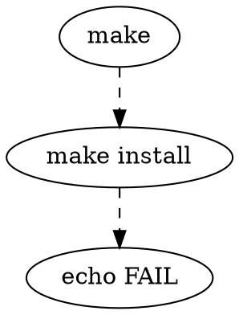

Control edges define an ordering DAG; the transpiler emits statements in a
topological order consistent with both control edges and data edges.

**Concurrency (resolved, §13):** independent nodes — those with no path between
them — are emitted **sequentially in source order by default**. To run a node
concurrently, set `gl_async=true`; the transpiler emits it with a trailing `&`
and adds a `wait` at the join. This keeps the common case reproducible while
leaving an explicit opt-in for parallel fan-out.

**Ordering ambiguity (resolved, §13):** when several topological orders are
valid, the transpiler picks a **deterministic order = source order**. Running
with `--strict` instead makes ambiguity an error, forcing the author to add
enough control edges to disambiguate.

### 6.2 Grouping — subshells, brace groups, functions

A `subgraph cluster_*` is a group. Its `gl_role` chooses the kind:

| cluster `gl_role`          | bash                           |
|----------------------------|--------------------------------|
| `subshell` *(default)*     | `( … )`                        |
| `group`                    | `{ …; }`                       |
| `function` + `gl_name=foo` | `foo() { …; }` (defined, then callable by a node `label="foo"`) |

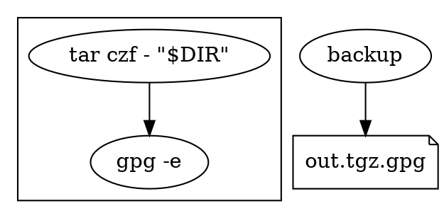

---

## 7. Variables and command substitution

A **value node** (`gl_role=value`, drawn `shape=oval`) is a shell variable.

- **Definition.** The node's `label` is `NAME=expr`, or just a value with the id
  as the name. `today [gl_role=value,label="today=$(date +%F)"]` → `today=$(date
  +%F)`.
- **Capture from a command (Commands/Typed).** An edge from a program node to a
  value node captures stdout: `cmd -> ver [gl_role=value]` with `gl_name=VER` →
  `VER=$(cmd)`.
- **Capture in Dataflow** is free: every node is already a value, so
  `ver [label="$(git describe)"]` *is* the assignment, and downstream edges
  reference it.
- **Use.** Any `$NAME` / `${NAME}` written inside a `label` is passed through to
  bash **literally** (the quoting boundary is resolved in §13: gripeline never
  re-quotes label text; `gl_raw` is the escape hatch). A `value -> program` edge
  means "make this variable available to this command"; the transpiler ensures
  the assignment precedes the use in the emitted ordering.

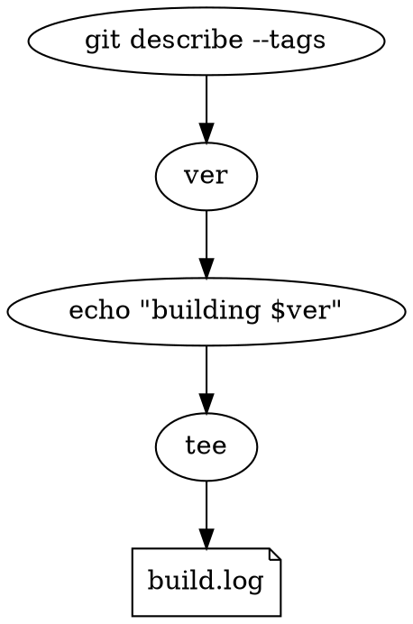

---

## 8. Loops

Two flavors, matching bash's two common loop shapes.

### 8.1 Iteration loops — annotated cluster

A `subgraph cluster_*` with a `gl_loop` attribute is a loop body; the attribute
is the loop header, and the cluster's contents are the body, run per iteration.

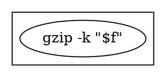

`gl_loop` headers the spec recognizes:

| `gl_loop` value                | bash                                  |
|--------------------------------|---------------------------------------|
| `for VAR in WORDS`             | `for VAR in WORDS; do … done`         |
| `while COND`                   | `while COND; do … done`               |
| `until COND`                   | `until COND; do … done`               |
| `while read VAR`               | `while read VAR; do … done` (fed by an in-edge → `done < input`) |

A `while read` loop fed by a data edge wires that edge to the loop's stdin:

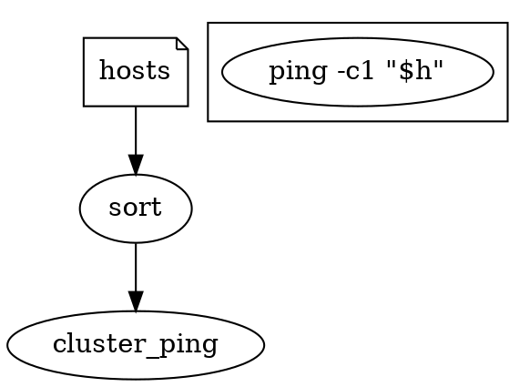

### 8.2 Feedback loops — cycles (resolved)

A *cycle in the data edges* expresses feedback. **Resolved (§13): an undeclared
data cycle is not executable** (§9, E04). To make a cycle executable you must
declare its semantics explicitly, either:

- `gl_role="coproc"` on the node that closes the loop → a `coproc` (bidirectional
  fifo pair); or
- `gl_loop="while …"` on a cluster that contains the cycle → a streaming loop.

This avoids guessing stream semantics from a picture that merely happens to have
a back-edge.

---

## 9. Renderable but not executable

Many valid pictures are not valid programs. gripeline distinguishes the two and,
when a graph can't run, reports why — both as text on stderr and, with
`--annotate`, as a copy of the graph where the offending elements get
`color=red`, a `tooltip`, and a `gl_error="…"` attribute, so the *rendered
picture explains itself*.

**Executability conditions** (failing any one makes the graph not executable):

| code | condition                                                       | reported reason |
|------|-----------------------------------------------------------------|-----------------|
| E01  | graph is `digraph` (not undirected `graph`)                     | "data flow needs direction; use `digraph`" |
| E02  | every program node has operation text (non-empty label or id)  | "node `x` has no operation" |
| E03  | no two data edges target the same fd of one node without a defined merge | "fd 0 of `x` has 2 inputs; use fan-in (`gl_role=op`/`cat`)" |
| E04  | data edges are acyclic *unless* the cycle is a declared `coproc`/loop | "data cycle `x→y→x` without loop/coproc semantics" |
| E05  | control edges are acyclic                                       | "ordering cycle among `a,b`" |
| E06  | every edge has a defined transpilation for its endpoint roles  | "edge `file→file` has no program between them" |
| E07  | a port refers to a fd only on a node that has one (no fds on file/value) | "`f:err` — file nodes have no fd 2" |
| E08  | at most one capture target per value, no conflicting captures  | "value `v` captured by 2 commands" |

**Output contract for a non-executable graph:**

```
$ gripeline run pipeline.dot
gripeline: pipeline.dot not executable (2 problems)
  - [E04] data cycle a -> b -> a without loop/coproc semantics
          declare gl_role="coproc" on a, or gl_loop on the cluster
  - [E02] node "filter" has no operation (empty label, id is not a command)
exit status: 65
```

Exit codes: `0` ran OK; `65` not executable (static check failed); `>0` other
codes propagate the bash pipeline's status (`pipefail` semantics by default).

A graph that is *executable* may still be *un-drawable nicely*, and vice versa;
the two properties are independent, which is the whole point.

---

## 10. Reserved attribute reference

All gripeline attributes live in the `gl_*` namespace so they never collide with
Graphviz's own attributes, and so Graphviz simply ignores them when drawing.

**Graph attributes**

| attribute       | values                       | meaning                          |
|-----------------|------------------------------|----------------------------------|
| `gl_mapping`    | `commands` `dataflow` `typed`| default convention (§4.4)        |
| `gl_prologue`   | shell text                   | replaces default `set -euo pipefail` |
| `gl_shell`      | `bash` (only, for now)       | target shell                     |

**Node attributes**

| attribute    | values                                           | meaning                       |
|--------------|--------------------------------------------------|-------------------------------|
| `gl_role`    | `program` `file` `stream` `value` `op` `coproc` `for` `while` `until` `if` `function` `subshell` `group` | role (§4.3, §6, §8) |
| `gl_name`    | identifier                                       | variable/function/capture name |
| `gl_append`  | `true`                                           | file write uses `>>`          |
| `gl_async`   | `true`                                           | run in background (`&`)       |
| `gl_loop`    | loop header string                               | cluster is a loop (§8)        |
| `gl_raw`     | shell text                                       | escape hatch: emit verbatim   |

**Edge attributes**

| attribute    | values                  | meaning                                   |
|--------------|-------------------------|-------------------------------------------|
| `gl_edge`    | `pipe`(default) `seq` `and` `or` `redirect` | edge kind (§3, §6)        |
| `gl_stderr`  | path / `2>&1`           | (Dataflow) fd routing for a program edge  |
| `gl_fd`      | raw redirection         | (Dataflow) arbitrary fd op on the edge    |

**Operation text** comes from `label` (node, or edge in the Dataflow mapping),
falling back to the node id. Anything inside `label` is treated as a bash
command/word list and emitted as written (you quote inside the label exactly as
you would in bash).

---

## 11. Conformance

A conforming **transpiler**:

1. MUST parse standard `dot`, including `subgraph`, ports, and default
   `node`/`edge`/`graph` statements.
2. MUST ignore every attribute outside the reserved set and the small role-shape
   set; in particular it MUST NOT change behavior based on `color`, `style`,
   `pos`, `fontname`, etc. (unless `--infer-style` is explicitly requested).
3. MUST run the §9 static check before emitting bash and refuse non-executable
   graphs with the documented exit code.
4. MUST emit bash whose behavior, under the (possibly overridden) prologue,
   realizes the semantics in §§4–8. The emitted bash is the normative meaning.
5. SHOULD offer `gripeline build` (print bash) distinct from `gripeline run`.
6. SHOULD offer `--annotate` to write a diagnostic-annotated `dot` copy.

A conforming **diagram** is any `dot` file; conformance is a property of the
*tool*, not the source. Every diagram is renderable; the tool decides
executability per §9.

The test harness in [`tests/`](tests/) encodes this contract as fixtures (see
[tests/README.md](tests/README.md)).

---

## 12. Example gallery

Each example gives the **bash** first (the gloss), then the **same program in all
three mappings**. Recall the recommended workflow is to *author* in whichever
mapping reads best; these side-by-sides exist to show the correspondence. Every
example here also exists as a fixture under `tests/cases/`.

### 12.1 A plain three-stage pipe

```bash
cat access.log | grep 404 | wc -l
```


*Commands is shortest here; Dataflow pays for naming the streams.*

### 12.2 Redirection in and out

```bash
grep 404 < access.log | wc -l > counts.txt
```


### 12.3 stderr routing (`2>` and `2>&1`)

```bash
make 2> build.err            # case 1
make 2>&1 | grep -i error    # case 2
```
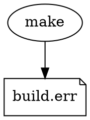
```dot
/* Commands/Typed, case 2 */ digraph {
  make[label="make"] g[label="grep -i error"]
  make:err -> make:out        // 2>&1
  make:out -> g }             // | grep -i error
```
```dot
/* Dataflow, case 2 (fd via edge attrs) */ digraph { gl_mapping="dataflow"
  build -> errs [label="grep -i error", gl_stderr="2>&1"]
  build[label="make"] }
```
*Ports make fd routing crisp in Commands/Typed; Dataflow expresses it with edge
attributes.*

### 12.4 Fan-out (`tee` / process substitution)

```bash
sort data.txt | tee >(head -1 > first.txt) >(tail -1 > last.txt) > sorted.txt
```
```dot
/* Commands/Typed */ digraph {
  data[shape=note,label="data.txt"]
  sorted[shape=note,label="sorted.txt"]
  first[shape=note,label="first.txt"] last[shape=note,label="last.txt"]
  s[label="sort"] h[label="head -1"] t[label="tail -1"]
  data -> s
  s -> sorted          // main output
  s -> h  h -> first   // branch 1  (via tee >(…))
  s -> t  t -> last    // branch 2
}
```
```dot
/* Dataflow */ digraph { gl_mapping="dataflow"
  data -> sorted [label="sort"]
  sorted -> first [label="head -1"]
  sorted -> last  [label="tail -1"]
  data[shape=note,label="data.txt"] sorted[shape=note,label="sorted.txt"]
  first[shape=note,label="first.txt"] last[shape=note,label="last.txt"] }
```
*Fan-out is where Dataflow reads best: one value, several consumers, no `tee`
noise.*

### 12.5 Fan-in (multiple inputs to one program)

```bash
cat <(curl -s host1/metrics) <(curl -s host2/metrics) | sort | uniq -c
```
```dot
/* Commands/Typed */ digraph {
  c1[label="curl -s host1/metrics"]
  c2[label="curl -s host2/metrics"]
  merge[label="cat", gl_role=op]    // op node: many inputs → cat <(..) <(..)
  s[label="sort"] u[label="uniq -c"]
  c1 -> merge
  c2 -> merge
  merge -> s -> u
}
```
```dot
/* Dataflow (needs an op node too — Dataflow's awkward case) */
digraph { gl_mapping="dataflow"
  m1 -> merged [label="curl -s host1/metrics"]
  m2 -> merged [label="curl -s host2/metrics"]   // two edges into one value node
  merged -> counted [label="sort | uniq -c"]
}
```
*Multi-input forces an `op`/merge node; this is the seam where both Commands and
Dataflow bend toward Typed.*

### 12.6 Sequencing and conditionals (`&&`, `||`)

```bash
make && make install || echo FAIL
```
```dot
/* Commands/Typed */ digraph {
  make[label="make"] inst[label="make install"] fail[label="echo FAIL"]
  make -> inst [gl_edge=and, style=dashed, color=darkgreen]
  inst -> fail [gl_edge=or,  style=dashed, color=orange]
}
```
*Dataflow is ill-suited to control flow; author conditionals in Commands/Typed.*

### 12.7 Subshell / function (grouping)

```bash
backup() { tar czf - "$DIR" | gpg -e; }
backup > out.tgz.gpg
```
```dot
/* Commands/Typed */ digraph {
  subgraph cluster_backup {
    gl_role="function"; gl_name="backup"
    t[label="tar czf - \"$DIR\""] g[label="gpg -e"]
    t -> g
  }
  call[label="backup"] out[shape=note,label="out.tgz.gpg"]
  call -> out
}
```

### 12.8 Variables and command substitution

```bash
ver=$(git describe --tags)
echo "building $ver" | tee build.log
```
```dot
/* Commands/Typed */ digraph {
  git[label="git describe --tags"]
  ver[gl_role=value, shape=oval]
  echo[label="echo \"building $ver\""] tee[label="tee"] log[shape=note,label="build.log"]
  git -> ver [gl_name="ver"]          // ver=$(git describe --tags)
  ver -> echo                         // ordering: define before use
  echo -> tee -> log
}
```
```dot
/* Dataflow (variable = node, very natural) */ digraph { gl_mapping="dataflow"
  ver[label="$(git describe --tags)"]
  ver -> announced [label="echo \"building $ver\""]
  announced -> log [label="tee"]
  log[shape=note,label="build.log"] }
```

### 12.9 A `for` loop

```bash
for f in *.txt; do gzip -k "$f"; done
```
```dot
/* Commands/Typed */ digraph {
  subgraph cluster_each {
    gl_loop="for f in *.txt"
    z[label="gzip -k \"$f\""]
  }
}
```

### 12.10 A streaming `while read` loop

```bash
sort hosts | while read h; do ping -c1 "$h"; done
```
```dot
/* Commands/Typed */ digraph {
  hosts[shape=note,label="hosts"]
  sort[label="sort"]
  hosts -> sort
  subgraph cluster_ping {
    gl_loop="while read h"
    p[label="ping -c1 \"$h\""]
  }
  sort -> cluster_ping            // data edge into a loop = its stdin
}
```

### 12.11 A fuller script (everything together)

```bash
#!/usr/bin/env bash
set -euo pipefail
ver=$(git describe --tags)
for svc in api web worker; do
  docker build -t "$svc:$ver" "./$svc" \
    && docker push "$svc:$ver" \
    || echo "FAILED $svc" >> failures.log
done | tee build.log
```
```dot
/* Typed (mix value + loop + control edges + redirect) */
digraph deploy {
  gl_prologue="set -euo pipefail"

  git [label="git describe --tags"]
  ver [gl_role=value, shape=oval]
  git -> ver [gl_name="ver"]                       // ver=$(git describe --tags)

  subgraph cluster_each {
    gl_loop="for svc in api web worker"

    build [label="docker build -t \"$svc:$ver\" \"./$svc\""]
    push  [label="docker push \"$svc:$ver\""]
    fail  [label="echo \"FAILED $svc\""]
    flog  [shape=note, label="failures.log", gl_append=true]

    build -> push [gl_edge=and, style=dashed]      // && docker push
    push  -> fail [gl_edge=or,  style=dashed]      // || echo FAILED
    fail  -> flog                                  // >> failures.log
  }

  tee  [label="tee"]
  blog [shape=note, label="build.log"]
  cluster_each -> tee                               // loop stdout | tee build.log
  tee -> blog

  ver -> cluster_each                               // ordering: ver before loop
}
```

This single file renders as a deploy diagram *and* runs as the script above.

---

## 13. Resolved decisions and open questions

**Resolved in Draft 0.2** (folded into the sections noted):

1. **Data cycles** (§8.2, §9 E04) — an undeclared data cycle is *not executable*;
   the author must declare `gl_role="coproc"` or a `gl_loop`. No inference.
2. **Concurrency** (§6.1) — independent nodes run *sequentially in source order*;
   `gl_async=true` opts a node into background execution (`&` + `wait`).
3. **Ordering ambiguity** (§6.1) — resolved *deterministically by source order*;
   `--strict` turns ambiguity into an error instead.
4. **Quoting boundary** (§7, §10) — label text is emitted *literally*; gripeline
   never re-quotes. The `gl_raw` attribute is the escape hatch for anything the
   readable forms can't express.

**Still open:**

5. **Arbitrary file descriptors.** fds 0/1/2 are first-class via ports. Should
   fds beyond those be modeled as named ports too, or left to `gl_raw`?
   *Undecided.*
6. **Multiple mappings in one file.** Per-element roles already allow mixing.
   Should `gl_mapping` additionally be settable *per-subgraph* for locality?
   *Undecided.*
